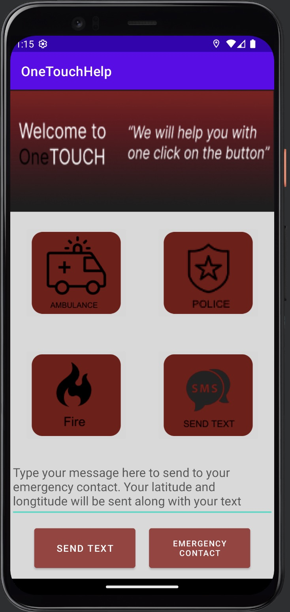

# Emergency Alert Global Version 

[![Contributors][contributors-shield]][contributors-url]
[![Forks][forks-shield]][forks-url]
[![Stargazers][stars-shield]][stars-url]
[![Issues][issues-shield]][issues-url]
[![LinkedIn][linkedin-shield]][linkedin-url]
<!-- [![MIT License][license-shield]][license-url] -->

<!-- PROJECT LOGO -->
 

  <h2 align="center">Emergency Alert Global Version </h3>

  

    An app that contacts you to the authority in just 1 click!
     
    <a href="https://github.com/DuyNguyenPhuong/Emergency-Alert-Global-Version"><strong>Explore the docs »</strong></a>
     
     
    <a href="https://github.com/DuyNguyenPhuong/Emergency-Alert-Global-Version/issues">Report Bug</a>
    ·
    <a href="https://github.com/DuyNguyenPhuong/Emergency-Alert-Global-Version/issues">Request Feature</a>
  

  
Table of Contents

  <ol>
    <li>
      <a href="#about-the-project">About The Project</a>
      <ul>
        <li><a href="#built-with">Built With</a></li>
      </ul>
    </li>
    <li>
      <a href="#getting-started">Getting Started</a>
      <ul>
        <li><a href="#prerequisites">Prerequisites</a></li>
        <li><a href="#installation">Installation</a></li>
      </ul>
    </li>
    <li><a href="#usage">Usage</a></li>
    <li><a href="#roadmap">Roadmap</a></li>
    <li><a href="#contributing">Contributing</a></li>
    <li><a href="#license">License</a></li>
    <li><a href="#contact">Contact</a></li>
    <li><a href="#acknowledgments">Acknowledgments</a></li>
  </ol>

## About the project

You are walking in a beautiful street in Rome and suddenly you got rob? What will you do? Search the internet to find the police number?
No thank you. Here comes Emergency Alert Global Verion, a mobile application that automatically call the police number based on your location. And you can activate it by saying a specific word.

This is actually how I was inspired to build this app. When travelling Europe, I was scammed right in front of the Effiel tower, got lost in Munich street and got robbed in Rome. However, in every country, the police number is different. Therefore, I built this app, which takes your location to get the emergency contact and call them whenever you say some words.

# This is how it looks like on your phone

## Built With

[![Kotlin][Kotlin]][Kotlin-url]  
![Java][Java]

(<a href="#readme-top">back to top</a>)

<!-- MARKDOWN LINKS & IMAGES -->
<!-- https://www.markdownguide.org/basic-syntax/#reference-style-links -->
[contributors-shield]: https://img.shields.io/github/contributors/DuyNguyenPhuong/Emergency-Alert-Global-Version.svg?style=for-the-badge
[contributors-url]: https://github.com/DuyNguyenPhuong/Emergency-Alert-Global-Version/graphs/contributors
[forks-shield]: https://img.shields.io/github/forks/DuyNguyenPhuong/Emergency-Alert-Global-Version.svg?style=for-the-badge
[forks-url]: https://github.com/DuyNguyenPhuong/Emergency-Alert-Global-Version/network/members
[stars-shield]: https://img.shields.io/github/stars/DuyNguyenPhuong/Emergency-Alert-Global-Version.svg?style=for-the-badge
[stars-url]: https://github.com/DuyNguyenPhuong/Emergency-Alert-Global-Versionstargazers
[issues-shield]: https://img.shields.io/github/issues/DuyNguyenPhuong/Emergency-Alert-Global-Version.svg?style=for-the-badge
[issues-url]: https://github.com/DuyNguyenPhuong/Emergency-Alert-Global-Version/issues
[license-shield]: https://img.shields.io/github/license/DuyNguyenPhuong/Emergency-Alert-Global-Version.svg?style=for-the-badge
[license-url]: https://github.com/DuyNguyenPhuong/Emergency-Alert-Global-Version/blob/main/LICENSE.txt
[linkedin-shield]: https://img.shields.io/badge/-LinkedIn-black.svg?style=for-the-badge&logo=linkedin&colorB=555
[linkedin-url]: https://www.linkedin.com/in/duyngp/

[product-screenshot]: images/CallDemo.jpg

[Java]: https://img.shields.io/badge/java-%23ED8B00.svg?style=for-the-badge&logo=java&logoColor=white
[Kotlin]: https://img.shields.io/badge/kotlin-%237F52FF.svg?style=for-the-badge&logo=kotlin&logoColor=white
[Kotlin-url]: https://kotlinlang.org/

[Next.js]: https://img.shields.io/badge/next.js-000000?style=for-the-badge&logo=nextdotjs&logoColor=white
[Next-url]: https://nextjs.org/
[React.js]: https://img.shields.io/badge/React-20232A?style=for-the-badge&logo=react&logoColor=61DAFB
[React-url]: https://reactjs.org/
[Vue.js]: https://img.shields.io/badge/Vue.js-35495E?style=for-the-badge&logo=vuedotjs&logoColor=4FC08D
[Vue-url]: https://vuejs.org/
[Angular.io]: https://img.shields.io/badge/Angular-DD0031?style=for-the-badge&logo=angular&logoColor=white
[Angular-url]: https://angular.io/
[Svelte.dev]: https://img.shields.io/badge/Svelte-4A4A55?style=for-the-badge&logo=svelte&logoColor=FF3E00
[Svelte-url]: https://svelte.dev/
[Laravel.com]: https://img.shields.io/badge/Laravel-FF2D20?style=for-the-badge&logo=laravel&logoColor=white
[Laravel-url]: https://laravel.com
[Bootstrap.com]: https://img.shields.io/badge/Bootstrap-563D7C?style=for-the-badge&logo=bootstrap&logoColor=white
[Bootstrap-url]: https://getbootstrap.com
[JQuery.com]: https://img.shields.io/badge/jQuery-0769AD?style=for-the-badge&logo=jquery&logoColor=white
[JQuery-url]: https://jquery.com 
